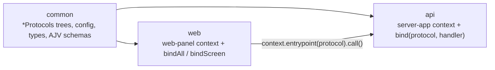

# OwlMeans Common

OwlMeans Common is the open-source TypeScript framework behind OwlMeans applications. It provides
immutable full-stack entrypoint protocols, context-based composition, cryptographic authentication,
one data-resource contract over several databases, queue and socket transports, and React web
packages. Packages are ESM and work with Bun workspaces or ordinary npm installs.

## Start here

Create a complete starter application:

```sh
npm create @owlmeans/app@latest my-app
# or
bun create @owlmeans/app my-app
```

The generated app has a shared contract package, Fastify API, and shadcn/Tailwind web app. For the
scaffolded and manual paths, see [Getting started](docs/getting-started.md).

For this monorepo, use Bun:

```sh
bun install
bun run build
bun run test
```

## Why OwlMeans Common — and why not

### Strengths

- **Agent-first.** Every published package ships version-matched skills in `agent-meta/`, and
  `@owlmeans/agent-skills` installs them into a project's `.agents/skills/`. The scaffolder also
  writes `AGENTS.md`, a shared memory graph and a self-education loop, so a coding agent works
  from the framework's own rules rather than from guesses.
- **Protocol-first contracts.** One immutable declaration carries the route, the typed and
  AJV-validated request and response, and the access rules. The server, the browser, a socket and a
  queue all bind that same object, so a changed contract breaks the compile on both sides at once.
- **Security built in, not bolted on.** Ed25519 key pairs and DIDs are the base credential. Guards
  and gates are declared on the protocol, and the organization entity model keeps a renameable
  slug on the wire and a stable id in storage.
- **One resource contract.** MongoDB, PostgreSQL, Redis, in-memory config records and the browser
  state store all answer `get`/`load`/`list`/`save`/`delete` with the same criteria language, sort
  and paging rules.
- **Swappable carriers.** `context.entrypoint(protocol).call()` goes over HTTP, a WebSocket or a
  job queue depending on the route declaration. Moving a call to a queue changes one declaration,
  not every call site.
- **Explicit composition.** One context per process, built by one factory from idempotent
  `append*` mixins. No decorators, no hidden container scanning, and no global singletons.
- **Exercised in production.** The OwlMeans Viable platform runs on these packages. The packages
  are MIT-licensed, strict TypeScript and ESM-only.

### Trade-offs

- **Pre-1.0.** Packages are published as `rc` releases with independent, deliberately uneven
  versions. APIs still move between releases.
- **Its own vocabulary.** Contexts, alias registries, protocols, guards and gates are in-house
  abstractions. They take time to learn and do not transfer from other frameworks.
- **Agent-first documentation.** The most complete and current guidance is in the skills, which
  are written for coding agents. Human-facing docs are thinner.
- **A fixed stack.** The server is Fastify, the web layer is React with shadcn UI and Tailwind v4,
  and tooling is centred on Bun. Other servers or view libraries need their own adapters.
- **Two web families.** The legacy MUI packages (`mui-panel`, `mui-oidc-rp`) remain for existing
  apps next to the current shadcn family.
- **Small ecosystem.** There are few third-party integrations, examples or community answers. React
  Native packages live in the separate `native` monorepo.

## Core concepts

| Term | Meaning | Package |
|---|---|---|
| **Context** | The one container a process runs in. It holds three flat registries keyed by alias — services, resources and entrypoints — where a later registration replaces an earlier one. `configure().init()` moves it through the `Configuration → Loading → Ready` stages. | [`context`](packages/context) |
| **Context factory / `append*` mixin** | Each layer exports a `makeContext(cfg)` that calls the factory of the layer below and applies its own idempotent `appendX(context)` mixins. An app writes exactly one factory the same way and calls it once. | [`server-app`](packages/server-app), [`web-panel`](packages/web-panel) |
| **Config** | The typed application config built by the layer's `config()`. It declares the services the app talks to, security, brand, plugin records and config records. | [`config`](packages/config) |
| **Service route** | A `service({ type, service, host, port, base })` entry in the config. It tells every app where another service lives, and entrypoints compute absolute addresses from it. | [`config`](packages/config) |
| **Service** | A named object bound to one context, created with `createService(alias, impl)` and read with `context.service(alias)`. Services with an `init` take part in the context lifecycle. | [`context`](packages/context) |
| **Resource** | Storage behind the uniform `Resource<T>` contract: CRUD plus one criteria, sort and paging language. It is registered on the context, and the backend is chosen by the resource package, not by the caller. | [`resource`](packages/resource) |
| **Route** | `route(alias, path, backend() \| frontend())`: an immutable declaration of a path segment, method, parent and service. Full paths and addresses are computed on demand against the context. | [`route`](packages/route) |
| **Protocol** | `protocol(route, contract, options)`: a route plus a typed request/response contract (`typed<T>(ajvSchema)`) plus `guards` and `gate`. It is a shared value with no server or browser behaviour, kept in a named `*Protocols` tree. | [`entrypoint`](packages/entrypoint) |
| **Entrypoint (binding)** | A protocol materialized in one context: `bind(protocol, handler)` on the server, `bindAll` or `bindScreen` in the browser, then `context.registerEntrypoints(...)`. `context.entrypoint(protocol)` answers `call()` for the value, `invoke()` for the value plus outcome, and `url()` for the address. | [`server-entrypoint`](packages/server-entrypoint), [`client-entrypoint`](packages/client-entrypoint) |
| **Handler** | A server function created from a protocol with `handlers<Context>().body`, `.params` or `.request`. Its arguments are inferred from the contract, and the request is validated before it runs. | [`server-api`](packages/server-api) |
| **Screen** | A frontend protocol bound to a React component with `bindScreen(protocol, handler(Component))`. A screen is navigated to (`url()`), never called. | [`client-entrypoint`](packages/client-entrypoint), [`client`](packages/client) |
| **Guard** | An authentication service named in a protocol's `guards`. The guard whose `match()` accepts the request resolves the `Auth` identity — the bearer guard `DEFAULT_GUARD`, `GUARD_ED25519` or OIDC. Guards are inherited from parent routes. | [`auth-common`](packages/auth-common), [`server-auth`](packages/server-auth) |
| **Gate** | An authorization service named in a protocol's `gate` (with `gateParams`). After authentication the server calls `gate.assert(request, response, params)` for the entrypoint's own gate and every ancestor's. | [`entrypoint`](packages/entrypoint), [`server-api`](packages/server-api) |
| **Transport** | A service registered under `transport:<protocol>` that carries `call()` for every route on that protocol. Without one the call goes over HTTP. Queue and socket transports plug in here. | [`entrypoint`](packages/entrypoint), [`queue`](packages/queue) |
| **Plugin** | An implementation chosen at runtime from a registry: router plugins, authentication and login plugins, LLM provider plugins and agent plugins. Config plugin records (`plugin(cfg, record)`) carry their settings. | [`router`](packages/router), [`client-auth`](packages/client-auth), [`llm`](packages/llm) |
| **Organization entity** | The customer or tenant. `entitySlug` is the renameable name and the only organization value on the wire. `entityId` is the stable record id used by storage and grants, obtained on the server with `requireEntityKey(req)`. | [`auth`](packages/auth), [`auth-common`](packages/auth-common) |
| **State store** | The browser's in-memory resource with live subscriptions, registered with `appendStateResource`. React reads it through `useStoreList` and `useStoreModel`. | [`state`](packages/state), [`client`](packages/client) |
| **Flow** | A serializable step/transition state machine whose whole state is one string, so a multi-step process survives redirects and reloads. | [`flow`](packages/flow), [`client-flow`](packages/client-flow) |
| **Resilient error** | A registered error class that marshals across a service boundary and is restored as the same class on the other side, with i18n-aware messages. | [`error`](packages/error) |
| **Agent skill / agent-meta** | Version-matched guidance for coding agents. Each package ships it in `agent-meta/`, and `npx @owlmeans/agent-skills@^0.1.18-rc.30` installs it. | [`agent-skills`](packages/agent-skills) |

## How an application is shaped

A typical OwlMeans application is three workspaces: a shared contract, a backend and a frontend.



Declare a protocol once in the shared package. It carries the route, request sections, response,
guards and gates; it is immutable and has no server or browser behaviour of its own.

```ts
import { contract, protocol, typed } from '@owlmeans/entrypoint'
import { backend, route, RouteMethod } from '@owlmeans/route'

interface CreateProject { name: string }
interface Project { id: string; name: string }

// Alias strings remain private to the declaration module. Runtime code imports protocol objects.
const aliases = { base: 'project', create: 'project:create' } as const
const projectBase = protocol(route(aliases.base, '/projects', backend()), contract())

export const projectProtocols = {
  base: projectBase,
  create: protocol(
    route(aliases.create, '/', backend({ parent: projectBase, method: RouteMethod.POST })),
    contract.request({ body: typed<CreateProject>() }, typed<Project>())
  ),
}
```

Bind the exact declaration on the server; callback arguments infer from the contract.

```ts
import { handlers } from '@owlmeans/server-api'
import { bind } from '@owlmeans/server-entrypoint'
import { projectProtocols } from './protocols.js'

const api = handlers<AppContext>()
export const serverBindings = [
  bind(projectProtocols.base),
  bind(projectProtocols.create, api.body(projectProtocols.create, async (body, context) =>
    context.projects.create(body)
  )),
]
```

Bind the same declarations in the client context. A direct protocol reference gives `call`,
`invoke`, and `url` their request and response types without a consumer-supplied generic.

```ts
import { bindAll } from '@owlmeans/client-entrypoint'

const clientBindings = bindAll(projectProtocols)
context.registerEntrypoints(clientBindings)

const project = await context.entrypoint(projectProtocols.create).call({
  body: { name: 'Roadmap' },
})
```

Use `openProtocol` only where an intentionally untyped boundary is required. Use
`typed<Model>(ajvSchema)` at an AJV declaration boundary so the runtime validator and TypeScript
model stay together. Server handlers use `handlers<Context>().body`, `.params`, or `.request`;
socket handlers use `connection(protocol, callback)`. Keep shared declarations in a named
`*Protocols` tree and keep materialized server/browser lists local (`*Bindings` or, where a public
API already calls it so, `entrypoints`). Do not create alias-addressed compatibility entrypoints or
replace entries in a mutable declaration list. Alias lookup is only for an intentionally dynamic
registry or broker boundary, never normal application code.

## Package catalogue

[`tree.md`](tree.md) is the dependency and build-order reference. Each package has its own README
and a canonical skill under [`.agents/skills`](.agents/skills).

### Application packages

These are the packages application code imports directly and most often. Their READMEs carry
concepts, worked examples, the full export list and common pitfalls.

**Shared contract** — imported by the `common` workspace and by both sides.

| Package | What it gives an app | Key exports |
|---|---|---|
| [`context`](packages/context) | The per-process container for services, resources and entrypoints | `createService`, `assertContext`, `AppType`, `ContextStage`, `BASE`/`HOME`/`GUEST` |
| [`config`](packages/config) | The typed application config and the service map | `service`, `plugin`, `makeSecurityHelper`, `appendConfigResource`, `toConfigRecord` |
| [`entrypoint`](packages/entrypoint) | Immutable, typed protocol declarations shared by server and client | `protocol`, `openProtocol`, `contract`, `typed`, `EntrypointOutcome` |
| [`route`](packages/route) | Route declarations: path segment, method, parent, service | `route`, `backend`, `frontend`, `RouteMethod`, `RouteProtocols` |
| [`resource`](packages/resource) | One CRUD, criteria and paging contract for every store | `Resource`, `Criteria`, `ListResult`, `UnknownRecordError`, `createListSchema` |
| [`auth`](packages/auth) | The authentication vocabulary: identity types, roles, errors | `Auth`, `AuthPayload`, `AuthRole`, `AuthForbidden`, `entitySlugOf` |
| [`error`](packages/error) | Errors that survive a service boundary with their class intact | `ResilientError`, `ResilientError.ensure`, `ResilientError.marshal` |

**Server** — the backend workspace.

| Package | What it gives an app | Key exports |
|---|---|---|
| [`server-app`](packages/server-app) | The backend bootstrap: one context factory and one `main` | `makeContext`, `main`, `config`, `sservice`, `entrypoints` |
| [`server-api`](packages/server-api) | Fastify HTTP server and protocol-typed handler factories | `handlers`, `createApiServer`, `appendApiServer` |
| [`server-entrypoint`](packages/server-entrypoint) | Materializes shared protocols with server handlers | `bind`, `bindAll` |
| [`server-auth`](packages/server-auth) | The Ed25519 bearer guard and the authentication service | `appendAuthService`, `makeAuthService`, `AUTH_CACHE` |
| [`server-auth-identity`](packages/server-auth-identity) | Local identities, profiles, provider linking and the organization-entity resolver | `appendAuthIdentityResources`, `IdentityLinkingService`, `makeEntityResolverService` |
| [`server-socket`](packages/server-socket) | WebSocket entrypoints bound from socket protocols | `connection`, `appendSocketService`, `createSocketMiddleware` |
| [`server-oidc-rp`](packages/server-oidc-rp) | Server-side OIDC relying party, guard and wrapped tokens | `appendOidcGuard`, `oidcEntrypoints`, `makeOidcClientService` |

**Data and jobs** — storage backends and queues behind the resource and transport contracts.

| Package | What it gives an app | Key exports |
|---|---|---|
| [`mongo-resource`](packages/mongo-resource) | MongoDB resources with schema validation, encryption and migrations | `makeMongoResource`, `MongoResource` |
| [`postgres-resource`](packages/postgres-resource) | PostgreSQL resources with the same contract and migrations | `makePostgresResource`, `PostgresResource` |
| [`redis-resource`](packages/redis-resource) | Redis resources: TTL records, pub/sub, streams, counters | `makeRedisResource`, `RedisResource` |
| [`queue`](packages/queue) | Job queues as resources and the QUEUE route transport | `declareQueue`, `listenQueues`, `enqueueProtocol` |

**Browser** — the web workspace.

| Package | What it gives an app | Key exports |
|---|---|---|
| [`web-panel`](packages/web-panel) | The web context factory, shadcn navigation shell, forms and panels | `makeContext`, `PanelApp`, `NavLayout`, `HOME` |
| [`web-client`](packages/web-client) | Browser bootstrap, rendering and the base client entrypoints | `makeContext`, `render`, `entrypoints` |
| [`client`](packages/client) | Platform-agnostic React hooks for context, navigation and state | `useContext`, `useNavigate`, `useStoreList`, `useStoreModel`, `useValue` |
| [`client-entrypoint`](packages/client-entrypoint) | Binds shared protocols for browser calls and screens | `bindAll`, `bindScreen`, `bind`, `ClientProtocolEntrypoint` |
| [`client-auth`](packages/client-auth) | Browser authentication service, sign-in manager and login plugins | `useSelfAuth`, `entrypoints`, `./manager`, `./login` |
| [`state`](packages/state) | The client state store with live subscriptions | `appendStateResource`, `StateModel` |

### Supporting packages

Lower-level building blocks, feature families and tooling. Most applications reach them through the
application packages above, or add one when they need that specific feature.

| Group | Packages |
|---|---|
| Configuration and tooling | [`agent-skills`](packages/agent-skills), [`cli-auth`](packages/cli-auth), [`create-app`](packages/create-app), [`dep-config`](packages/dep-config), [`viable-mcp`](packages/viable-mcp), [`viable-sdk`](packages/viable-sdk) |
| Core foundations | [`basic-envelope`](packages/basic-envelope), [`basic-ids`](packages/basic-ids), [`basic-keys`](packages/basic-keys), [`did`](packages/did), [`i18n`](packages/i18n), [`router`](packages/router), [`socket`](packages/socket) |
| Cross-cutting domain | [`agent`](packages/agent), [`agent-common`](packages/agent-common), [`auth-otp`](packages/auth-otp), [`consent`](packages/consent), [`flow`](packages/flow), [`iam`](packages/iam), [`llm`](packages/llm), [`llm-common`](packages/llm-common), [`mailer`](packages/mailer), [`oidc`](packages/oidc), [`payment`](packages/payment), [`viable-common`](packages/viable-common), [`wled`](packages/wled) |
| Auth shared | [`auth-common`](packages/auth-common), [`auth-token`](packages/auth-token), [`oauth`](packages/oauth) |
| API and runtime config | [`api`](packages/api), [`api-config`](packages/api-config), [`api-config-client`](packages/api-config-client), [`api-config-server`](packages/api-config-server) |
| Storage and infrastructure | [`image-resource`](packages/image-resource), [`kluster`](packages/kluster), [`mailer-smtp`](packages/mailer-smtp), [`mongo`](packages/mongo), [`postgres`](packages/postgres), [`redis`](packages/redis), [`redis-queue`](packages/redis-queue), [`server-mailer-mailgun`](packages/server-mailer-mailgun), [`static-resource`](packages/static-resource), [`storage-common`](packages/storage-common), [`storage-resource`](packages/storage-resource) |
| Server | [`server-auth-otp`](packages/server-auth-otp), [`server-auth-token`](packages/server-auth-token), [`server-config`](packages/server-config), [`server-context`](packages/server-context), [`server-iam`](packages/server-iam), [`server-job`](packages/server-job), [`server-oauth`](packages/server-oauth), [`server-oidc-provider`](packages/server-oidc-provider), [`server-payment`](packages/server-payment), [`server-route`](packages/server-route), [`server-wl`](packages/server-wl) |
| Client | [`client-config`](packages/client-config), [`client-context`](packages/client-context), [`client-did`](packages/client-did), [`client-flow`](packages/client-flow), [`client-i18n`](packages/client-i18n), [`client-iam`](packages/client-iam), [`client-job`](packages/client-job), [`client-panel`](packages/client-panel), [`client-payment`](packages/client-payment), [`client-resource`](packages/client-resource), [`client-route`](packages/client-route), [`client-socket`](packages/client-socket), [`client-wl`](packages/client-wl) |
| Web | [`astro`](packages/astro), [`mui-oidc-rp`](packages/mui-oidc-rp), [`mui-panel`](packages/mui-panel), [`web-auth`](packages/web-auth), [`web-auth-token`](packages/web-auth-token), [`web-consent`](packages/web-consent), [`web-db`](packages/web-db), [`web-flow`](packages/web-flow), [`web-gtm`](packages/web-gtm), [`web-oauth`](packages/web-oauth), [`web-oidc-provider`](packages/web-oidc-provider), [`web-oidc-rp`](packages/web-oidc-rp), [`web-payment`](packages/web-payment), [`web-router`](packages/web-router), [`web-router-react-router`](packages/web-router-react-router), [`web-wl`](packages/web-wl) |
| Test support | [`test`](packages/test), [`test-auth`](packages/test-auth), [`test-integration`](packages/test-integration), [`test-ui`](packages/test-ui) |

The current web family is shadcn UI and Tailwind CSS v4 (`web-panel`). `mui-panel` and
`mui-oidc-rp` are supported only for existing MUI applications.

## Agent guidance

Published packages include generated, version-matched guidance in `agent-meta/`. Install it after
installing OwlMeans packages:

```sh
npx @owlmeans/agent-skills@^0.1.18-rc.30
```

The installer copies applicable skills to `.agents/skills/`; `CLAUDE.md` provides the generated
Claude Code links. In this monorepo, edit only canonical files under `.agents/skills/` and run
`bun run scripts/sync-agent-meta.ts --project common`; never edit package `agent-meta/` copies.

## Contributing

Read [AGENTS.md](AGENTS.md), the relevant package skill, and [tree.md](tree.md) before changing a
package. Package versions are independent; do not synchronize them. Publish only with explicit
operator approval.
